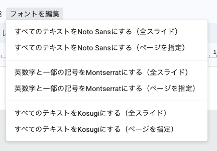

# Google スライド フォント編集アドオン

Google スライドのフォントを一括で編集するためのアドオンです。



## 機能

- **すべてのテキスト変換**: スライド内のすべてのテキストを指定されたフォントに変換（デフォルト: Noto Sans JP）
  - 全スライド対象
  - 指定ページのみ
- **英数字変換**: 英数字と一部の記号（%, /, #, @, &, +, -, \*）を指定されたフォントに変換（デフォルト: Montserrat）
  - 全スライド対象
  - 指定ページのみ
- **日本語フォント変換**: 全てのテキストを指定されたフォントに変更（デフォルト: Kosugi）
  - 全スライド対象
  - 指定ページのみ
  - 注: 全てのテキストを変更した後、英数字を変更する機能を使うことで、結果的に日本語だけフォント変更することを想定

**注意**: 使用するフォントは設定ファイル（`config.prod.js` または `config.test.js`）で変更できます。

### 特徴

- 元の Bold スタイルを維持
- テーブル内のテキストにも対応
- グループ化されたオブジェクト内のテキストにも対応

## インストール方法

1. Google Workspace Marketplace からアドオンをインストール（内部アプリのリンクは機密情報のため削除）
2. ブラウザを更新
3. Google スライドで「拡張機能」→「フォントを編集」から機能を利用

## 使い方

Google スライドを開き、「拡張機能」→「フォントを編集」メニューから以下の機能を選択できます：

- スライド内すべてのテキストを変換（設定ファイルで指定されたフォントを使用）
- 英数字と一部の記号を変換（ページを指定）
- 英数字と一部の記号を変換（スライド内すべて）
- すべてのテキストを変換（日本語用フォント）

**注意**: メニューのテキストと使用するフォントは設定ファイルでカスタマイズできます。

---

## 開発者向け情報

### プロジェクト構造

```
update-google-slides-1/
├── src/                    # GASソースコード
│   ├── config.prod.js.example      # 本番環境用設定テンプレート
│   ├── config.test.js.example      # テスト環境用設定テンプレート
│   ├── config.prod.js      # 本番環境用設定（.exampleからコピーして作成）
│   ├── config.test.js      # テスト環境用設定（.exampleからコピーして作成）
│   └── config.js           # 現在の環境設定（自動生成）
├── docs/                   # ドキュメント・画像
├── Makefile                # ビルドツール
├── switch-clasp.sh         # プロジェクト切り替えスクリプト
├── .clasp.prod.json.template        # 本番環境のclasp設定テンプレート
├── .clasp.test.json.template        # テスト環境のclasp設定テンプレート
├── .clasp.prod.json        # 本番環境のclasp設定（.templateからコピーして作成）
├── .clasp.test.json        # テスト環境のclasp設定（.templateからコピーして作成）
└── .clasp.json             # 現在の環境設定（自動生成）
```

**注意**: `.clasp.json` は `switch-clasp.sh` によって `.clasp.prod.json` または `.clasp.test.json` から自動生成されます。直接編集する必要はありません。

### 設定ファイル

フォント名やメニューテキスト、scriptIdなどの設定は環境別の設定ファイルで管理されています。

#### 環境別設定ファイル

- `src/config.prod.js.example`: 本番環境用の設定テンプレート
- `src/config.test.js.example`: テスト環境用の設定テンプレート
- `src/config.prod.js`: 本番環境用の設定（`.example`からコピーして作成）
- `src/config.test.js`: テスト環境用の設定（`.example`からコピーして作成）
- `src/config.js`: 現在の環境の設定（`switch-clasp.sh`によって自動生成）

**注意**: 
- `src/config.js` は `switch-clasp.sh` によって `config.prod.js` または `config.test.js` から自動生成されます。直接編集する必要はありません。
- 初回セットアップ時は、`.example`ファイルをコピーして実際の設定ファイルを作成してください。

#### 設定可能な項目

各環境の設定ファイル（`config.prod.js` または `config.test.js`）で以下の項目を設定できます：

- **scriptId**: Google Apps ScriptのスクリプトID
- **フォント設定** (`fonts`)
  - `all.family`: すべてのテキストに適用するフォント（デフォルト: "Noto Sans JP"）
  - `japanese.family`: 日本語フォント（全てのテキストをこのフォントに変更後、英数字を変更することで日本語だけ変更する想定）（デフォルト: "Kosugi"）
  - `english.family`: 英数字と一部の記号に適用するフォント（デフォルト: "Montserrat"）
  - `english.weight`: 英数字フォントのウェイト（デフォルト: 500.0）
  - `english.targetChars.pattern`: 英数字フォント変換対象の文字パターン（正規表現）
  
  例：すべてのテキストに「游ゴシック」を使用する場合：
  ```javascript
  all: {
    family: "游ゴシック",
    ...
  }
  ```

- **メニュー設定** (`menu`)
  - `title`: メニューのタイトル
  - `items`: 各メニューアイテムのテキスト
    - `all`: すべてのテキストを変換するメニューアイテム
    - `englishByPage`: 英数字をページ指定で変換するメニューアイテム
    - `englishAll`: 英数字を全スライドで変換するメニューアイテム
    - `japanese`: 日本語テキストを変換するメニューアイテム

#### 設定の変更方法

1. 本番環境の設定を変更する場合: `src/config.prod.js` を編集
2. テスト環境の設定を変更する場合: `src/config.test.js` を編集
3. 変更後は `make push-test` または `make push-prod` でデプロイしてください

環境を切り替えると、`switch-clasp.sh` が自動的に適切な設定ファイルを `config.js` にコピーします。

### 開発環境のセットアップ

#### セットアップ（初回のみ）

1. 新しい Google スライドを作成
2. 「拡張機能」→「Apps Script」をクリック
3. GAS エディタで「プロジェクトの設定」（歯車アイコン）→「スクリプト ID」をコピー
4. 設定ファイルを作成：

```bash
# テスト環境用設定ファイルを作成
cp src/config.test.js.example src/config.test.js
# エディタで src/config.test.js を開き、YOUR_TEST_SCRIPT_ID_HERE を実際のスクリプトIDに置き換え

# 本番環境用設定ファイルを作成（本番環境も使用する場合）
cp src/config.prod.js.example src/config.prod.js
# エディタで src/config.prod.js を開き、YOUR_PROD_SCRIPT_ID_HERE を実際のスクリプトIDに置き換え

# clasp設定ファイルを作成
cp .clasp.test.json.template .clasp.test.json
# エディタで .clasp.test.json を開き、YOUR_TEST_SCRIPT_ID_HERE を実際のスクリプトIDに置き換え

# 本番環境用clasp設定ファイルを作成（本番環境も使用する場合）
cp .clasp.prod.json.template .clasp.prod.json
# エディタで .clasp.prod.json を開き、YOUR_PROD_SCRIPT_ID_HERE を実際のスクリプトIDに置き換え
```

または、`make setup-test`コマンドを使用することもできます：

```bash
make setup-test SCRIPT_ID=<取得したスクリプトID>
```

#### 動作確認

```bash
# テスト用プロジェクトにコードをプッシュ
# （内部で switch-clasp.sh が .clasp.test.json を .clasp.json にコピーします）
make push-test

# スライドをリロードして、メニューから各機能をテスト
```

#### 本番用にプッシュ

```bash
# 本番用プロジェクトにコードをプッシュ
# （内部で switch-clasp.sh が .clasp.prod.json を .clasp.json にコピーします）
make push-prod
```

**補足**: `make push-test` や `make push-prod` は、内部で `switch-clasp.sh` を呼び出して `.clasp.json` を切り替えてから `clasp push` を実行します。

### デプロイと公開

アドオンを公開するには、以下の手順が必要です：

1. **デプロイ**: GAS エディタから「デプロイ」→「新しいデプロイ」で拡張機能としてデプロイ
2. **GCP での公開設定**: Google Workspace Marketplace SDK で内部アプリとして公開設定

詳細な手順は[参考サイト](https://officeforest.org/wp/google-spreadsheet%E7%94%A8%E3%81%AE%E7%B5%84%E7%B9%94%E5%86%85%E3%82%A2%E3%83%89%E3%82%AA%E3%83%B3%E3%82%92%E4%BD%9C%E6%88%90%E3%81%99%E3%82%8B%E3%80%90gas%E3%80%91/)を参照してください。

### 参考リンク

- **参考サイト**: https://officeforest.org/wp/google-spreadsheet%E7%94%A8%E3%81%AE%E7%B5%84%E7%B9%94%E5%86%85%E3%82%A2%E3%83%89%E3%82%AA%E3%83%B3%E3%82%92%E4%BD%9C%E6%88%90%E3%81%99%E3%82%8B%E3%80%90gas%E3%80%91/

**注意**: 本番用スクリプト、テスト用スライド、GCPプロジェクト、内部アプリのリンクは機密情報を含むため、公開リポジトリからは削除しています。

## バージョン履歴

### Ver6 (2026/01/18)

**ページ指定機能の追加とメニューの改善**

- **メニューの改善**
  - 機能ごとにグループ化し、視認性と統一感を向上
- **内部構造の汎用化**
  - 裏側の実装を汎用化したため、設定ファイルを変更するだけで使用するフォントを簡単に変更できるようになりました

### Ver5 (2026/01/14)

**Noto Sans 変換機能の拡張**

- **ページ指定機能を追加**
  - Noto Sans 変換に「ページを指定」オプションを追加
  - 重たいスライドでもページ単位で処理できるため、エラーを回避可能
  - Montserrat 変換と同様に、全スライド対象と指定ページのみの 2 つのオプションを提供

### Ver4 (2024/08/28)

**Noto Sans 変換機能を追加**

- **Noto Sans 変換機能を追加**
  - スライド内のすべてのテキストを Noto Sans JP フォントに変換する機能を追加
  - Kosugi 変換と同様に、すべてのテキスト要素に対応

### Ver3 (2023/07/12)

**Montserrat 変換対象の拡張**

- 変換対象に以下の記号を追加: `%`, `/`, `#`, `@`, `&`, `+`, `-`, `*`
- 変換対象の完全なリスト:
  - 大文字と小文字のアルファベット
  - 数字
  - 特殊文字: `%`, `/`, `#`, `@`, `&`, `+`, `-`, `*`

### Ver2 (2023/07/06)

**新機能追加と機能改善**

- **Kosugi 変換機能を追加**
  - スライド内のすべてのテキストを Kosugi フォントに変換する機能を追加
- **グループ化オブジェクトへの対応**
  - グループ化されたオブジェクト内のテキストにも変換処理を適用

### Ver1 (2023/06/28)

**初回リリース**

- **Montserrat 変換機能**
  - フォント置換対象: 英数字、`%`, `/`, `#`, `@`, `&`
  - 元の文字列が Bold であれば Bold を維持
  - 結合された表オブジェクトでは左上セルのみ置換
