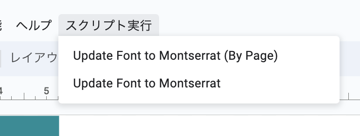
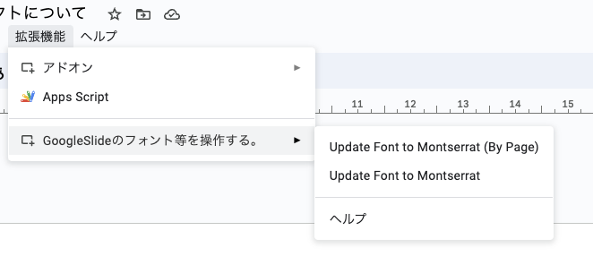

# Google スライドのフォントから、特定の文字を Montserrat に置換するスクリプト

## 仕様

- フォント置換対象
  英数字、「,」「%」「/」「#」「@」「&」

- その他
  - 元の文字列が Bold であれば Bold を維持します。
  - 結合された表オブジェクトでは左上セルのやつだけ置換されます。

## 使い方(1)

スライドのメニューから実行する。

- 都度テンプレスライドをコピペすればスクリプトごとコピーされるので、初回の承認だけやって使う。
- By Page を選ぶと、ページを指定して実行できる
- とはいえ、50 ページ程度なら全体に対して適応しても 10 秒くらいで終わることを確認済
  

### テンプレスライド

https://docs.google.com/presentation/d/1ygqnknknpSCoLOjGaqEIU1jiogQUyC7ywHTjEigMdRM/edit#slide=id.g244c1510e6d_0_59

## 使い方(2)

アドオンを入れる。

1. アドオンを取得する。
   1. 
   2. 内部アプリから、アドオンを選択
      1. 
   3. インストール
      1. 
2. 一旦ブラウザ更新
3. 拡張機能から起動
   1. 

## 毎回コピーしなくてもアドオンとして利用可能にする方法

- GCP プロジェクト
  https://console.cloud.google.com/welcome?authuser=0&project=wired-framework-391207

- 参考にしたサイト
  https://officeforest.org/wp/2022/12/24/google-spreadsheet%E7%94%A8%E3%81%AE%E7%B5%84%E7%B9%94%E5%86%85%E3%82%A2%E3%83%89%E3%82%AA%E3%83%B3%E3%82%92%E4%BD%9C%E6%88%90%E3%81%99%E3%82%8B%E3%80%90gas%E3%80%91/
